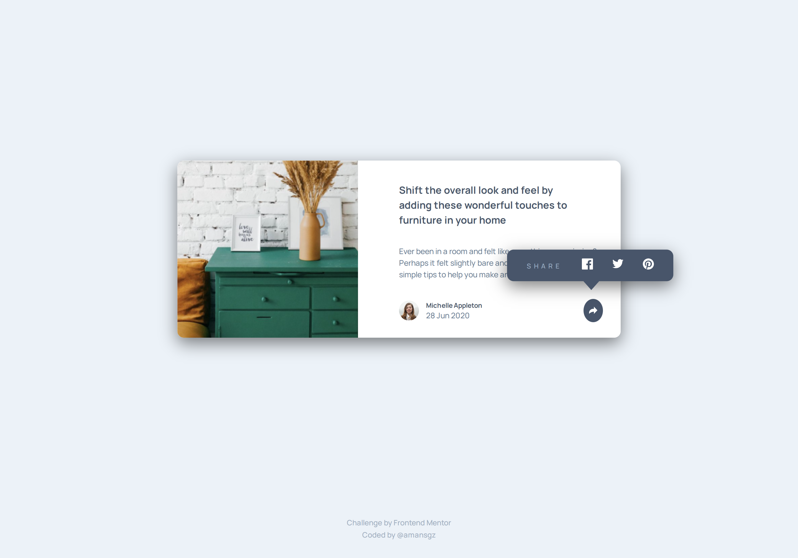

# 👩‍💻 Frontend Mentor - Article Preview Component

[Frontend Mentor challenges](https://www.frontendmentor.io/) help you improve your coding skills by building realistic projects.

This is a solution for [Article Preview Component](https://www.frontendmentor.io/challenges/article-preview-component-dYBN_pYFT) challenge.

## The challenge

The challenge is to build out this article preview component and get it looking as close to the design as possible.

Users should be able to:

- View the optimal layout for the component depending on their device's screen size
- See the social media share links when they click the share icon

## Built with

- Semantic HTML5 markup
- CSS custom properties
- Flexbox
- CSS Grid
- Mobile-first workflow

## Live site solution

[Live site](https://amansgz.github.io/css-article-preview-component/) deployed with GitHub Pages.

## Author

- Frontend Mentor - [@amansgz](https://www.frontendmentor.io/profile/amansgz)